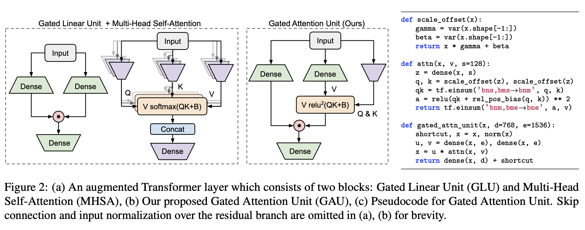

# GAU - TensorFlow
Gated Attention Unit (TensorFlow implementation) from the paper [Transformer Quality in Linear Time](https://arxiv.org/pdf/2202.10447.pdf).

They presented a simpler and more efficient architecture than the Vanilla Transformer. It also suffers from quadratic complexity over the context length, but the authors claim it can replace the Multi-Headed Attention with reducing the number of heads to just a single one.

The key idea is to **formulate attention and GLU** (Gated Linear Unit) as a unified layer to share their computation as much as possible. This not only results in higher param/compute efficiency, but also natu- rally enables a powerful attentive gating mechanism. (Section 2.)



## Roadmap
- [x] GAU module, Transformer Model
- [x] AutoregressiveWrapper (top_p, top_k)
- [x] Rotary Embeddings
- [ ] ScaleNorm + FixNorm experiment from the [paper](https://arxiv.org/pdf/1910.05895.pdf)
- [ ] Extend inference with tokenizer and __call__(str) method to directly call the text
- [ ] Implement custom 'pre_train_step' and 'legacy_train_step' for compatibility with model.fit (LegacyModel)
- [ ] 'gau_tensorflow_slim.py' using tf-slim to further optimise the model
- [ ] citation for laplace attn fn

> [!WARNING]
> This repository is under developemnt, so expect changes regulary but please feel free to explore and provide any feedback or suggestions you may have. :construction:

## Install
Install through `pip`
```shell
!pip install git+https://github.com/brandnewchoppa/gau-tensorflow.git
```
Clone to colab with `git`
```shell
!git clone https://github.com/brandnewchoppa/gau-tensorflow.git
!mv /content/gau-tensorflow/gau_tensorflow .
!rm -rf gau-tensorflow
```

## Usage

```python
import tensorflow as tf
from gau_tensorflow import GAUTransformer

model = GAUTransformer(
    emb_dim = 128,            # embedding dimension
    n_tokens = 50257,         # number of tokens used in the vocabulary
    depth = 4,                # number of blocks stacked in the model
    causal = True             # autoregressive functionality
    use_rope = False,         # rotary position embeddings
    laplace_attn_fn = False   # laplacian attention function
)

x = tf.random.uniform([1, 512], 0, 50257, tf.int64)
logits = model(x, training = False)
```

### Interpolate Sequence Positions

```python
for i in range(model.depth):
    model.get_layer('blocks').get_layer(f'gau{i}').rotary_pos_embs.interpolate_factor = 2.0
```


## Citations

```bibtex
@article{Hua2022TransformerQI,
    title   = {Transformer Quality in Linear Time},
    author  = {Weizhe Hua and Zihang Dai and Hanxiao Liu and Quoc V. Le},
    journal = {ArXiv},
    year    = {2022},
    volume  = {abs/2202.10447}
}
```

```bibtex
@article{Toan2019TransformerwT,
    title   = {Transformers without Tears: Improving the Normalization of Self-Attention},
    author  = {Toan Q. Nguyen and Julian Salazar},
    journal = {ArXiv},
    year    = {2019},
    volume  = {abs/1910.05895}
}
```

```bibtex
@article{Xuezhe2023MEGA,
    title   = {Transformers without Tears: Improving the Normalization of Self-Attention},
    author  = {Xuezhe Ma and Chunting Zhou and Xiang Kong and Junxian He and Liangke Gui and Graham Neubig and Jonathan May and Luke Zettlemoyer},
    journal = {ArXiv},
    year    = {2023},
    volume  = {abs/2209.10655}
}
```
